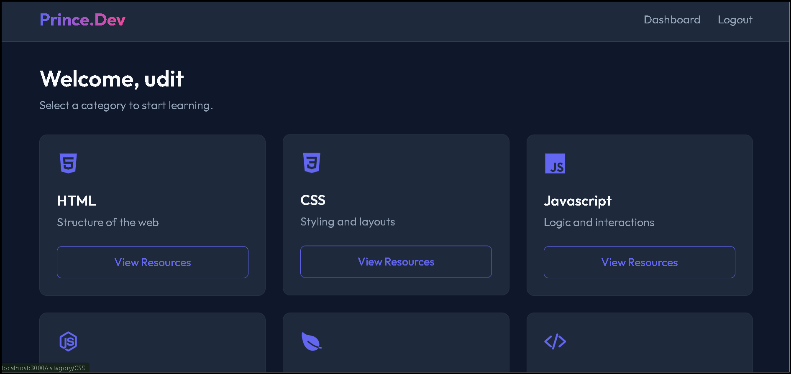

# Prince Web Development - Learning Platform

A comprehensive Student Learning Portal designed for mastering web development. Built with the **MEN Stack** (MongoDB, Express, Node.js), this platform offers a premium, modern interface for students to access curated learning resources.

## 🚀 Features

### 🎓 Student Features

- **Secure Authentication**: Login and Signup with encrypted passwords.
- **Dynamic Dashboard**: View personalized dashboard with learning categories.
- **Categorized Resources**: Access resources by topic (HTML, CSS, JS, Python, etc.).
- **Rich Media Support**: Watch embedded YouTube videos directly on the platform or view PDFs and Articles.
- **Responsive Design**: A beautiful, glassmorphism-inspired dark UI that works on all devices.

### 🛡️ Admin Features

- **Admin Panel**: Dedicated portal for managing the platform.
- **Resource Management**: Add, Edit, and Delete learning resources (Videos, PDFs, Articles, Links).
- **File Uploads**: Upload PDF files directly to the server.
- **Student Management**: View all registered students and Block/Unblock access if necessary.
- **Custom Categories**: Create and manage custom learning categories on the fly.

## 🛠️ Tech Stack

- **Frontend**: EJS (Templating), CSS3 (Custom Glassmorphism Design), JavaScript
- **Backend**: Node.js, Express.js
- **Database**: MongoDB (Mongoose)
- **Authentication**: bcrypt (Password Hashing), express-session
- **File Handling**: Multer (PDF Uploads)

## 📦 Installation

1.  **Clone the Repository**

    ```bash
    git clone https://github.com/princekumar9234/learn-platform.git
    cd learn-platform
    ```

2.  **Install Dependencies**

    ```bash
    npm install
    ```

3.  **Environment Setup**
    Create a `.env` file in the root directory:

    ```env
    MONGO_URI=mongodb://127.0.0.1:27017/learn-platform
    SESSION_SECRET=your_secret_key
    NODE_ENV=development
    ```

4.  **Seed Admin User**
    Initialize the admin account:

    ```bash
    node seed-admin.js
    ```

5.  **Run the Server**
    ```bash
    npm start
    ```
    Access the app at `http://localhost:3000`

## 🖼️ Screenshots

(Add screenshots of Dashboard, Login, and Admin Panel here)

## 📜 License

This project is open-source and available for educational purposes.

### LEARN PLATFORM VIEW


